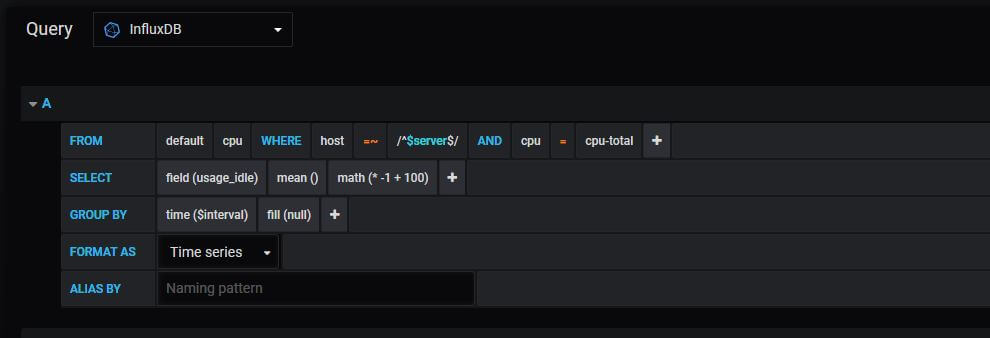
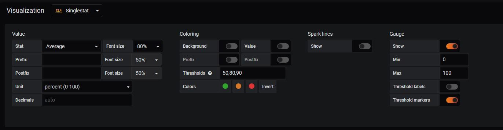
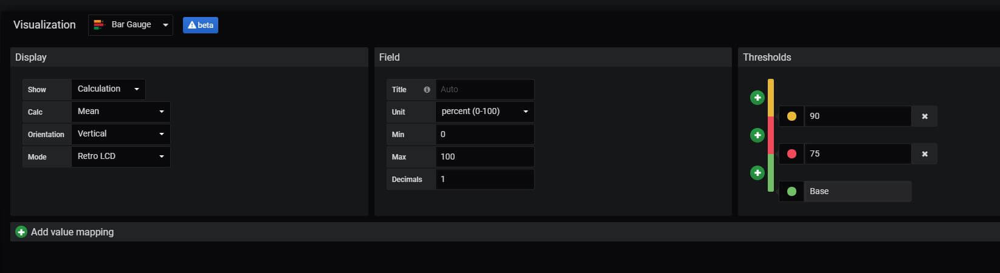
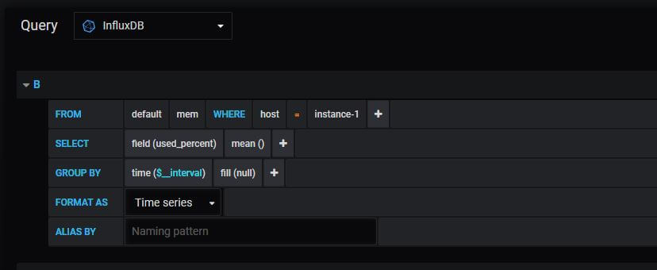
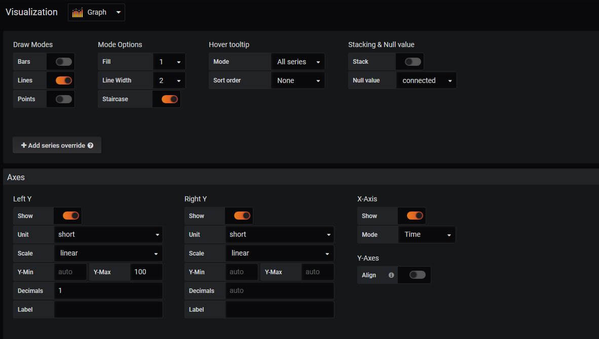

# Grafana

Para utilizar o grafana, utilizei uma imagem simples do ubuntu provisionada pelo vagrant

Provisionei o Docker com os comandos:

```
# Download do script
$$ curl -fsSL https://get.docker.com -o get-docker.sh

# Instalando
$$ sh get-docker.sh

# Dando permissão para o usuário
$$ sudo usermod -aG docker vagrant

# Recarregando as permissões
$$ exit
$ vagrant ssh

# Testando a instalação
$$ docker ps

```

Provisionei o grafana com os comandos:

```
$$ mkdir -p  $PWD/grafana-alura/volumes/grafana
$$ cd $PWD/grafana-alura/

# Criando a rede do docker para o grafana
$$ docker network create grafana-net

# Definindo a instalação do grafana para o user atual e instalando
$$ ID=$(id -u)
$$ docker run -d --user $ID                  \
    -v "$PWD/volumes/grafana:/var/lib/graf  \
    -p 3000:3000                            \
    --name=grafana                          \
    --network=grafana-net                   \
    grafana/grafana
$$ docker ps
```

Como o grafana só exibe, cria e gere paineis com gráficos e detalhes de monitoramento e infraestrutura, é preciso de programas externos e compatíveis para armazenar e enviar os dados para ele. Pra isso usei o InfluxDB

```
$ mkdir -p $PWD/volumes/influxdb

$ docker run -d -v "$PWD/volumes/influxdb:/var/lib/influxdb"    \
    -p 8083:8083                                                \
    -p 8086:8086                                                \
    -p 25826:25826/udp                                          \
    --name=influxdb                                             \
    --network=grafana-net                                       \
    influxdb:1.0
```

Além disso é preciso ter um coletor de métricas para enviar os dados para o banco de dados de métricas. Neste caso utilizei o Telegraf.

```
$wget -qO- https://repos.influxdata.com/influxdb.key | sudo apt-key add -
$source /etc/lsb-release
$echo "deb https://repos.influxdata.com/${DISTRIB_ID,,} \
    ${DISTRIB_CODENAME} stable" |                   \
    sudo tee /etc/apt/sources.list.d/influxdb.list
$sudo apt-get update && sudo apt-get install telegraf
$sudo service telegraf start
```

Ver as métricas pelo próprio GIT:

```
# Conectando no Influx
$ docker exec -ti influxdb bash
$ influx

# Acessando as métricas
> use telegraf
> show measurements;
> exit
$ exit
```

Acessar o grafana por `[ip]:3000` no navegador e:

###### Configurar a database

Configuration > Data Sources > Add data source > InfluxDB

- Name: InfluxDB
- URL: [ip]:8086
- Access: Browser
- Database: telegraf
- Save & Test


###### Criar filtro por servidor

O telegraf pode ser instalado em inumeras máquinas servidores e salvar os dados em um banco de dados central, sendo assim é possível criar esse filtro. No meu caso só usei uma máquina com Telegraf.

Create > Dashboard > Configurações

- General > Name: Nome qualquer
- Variables > Type: Query
- Variables > Name: server
- Variables > Type: Query
- Variables > Data source: InfluxDB
- Variables > Query: SHOW TAG VALUES FROM system WITH KEY=host
- New Panel > Add Query

##### Exemplos de criacao de gráficos

- CPU




- Disco




- Memoria RAM




##### Testando estresse

Como não tinha um programa pesando na máquina virtual coloquei um pacote do debian que força estresse na máquina

```
$ sudo apt-get update
$ sudo apt-get install stress-ng

# Estressando a CPU do servidor
$ stress-ng -c 0 -l 95

# Criando um arquivo grande no servidor
$ dd if=/dev/zero of=arquivo.img bs=1M count=3000

# Estressando a Memória do servidor
$ stress-ng --vm-bytes \
  $(awk \
    '/MemAvailable/{printf "%d\n", $2 * 0.9;}' \
    < /proc/meminfo\
  )k \
  --vm-keep -m 1
```

##### Criando time series de monitoramento do docker

```
$sudo usermod -aG docker telegraf
$cat telegraf.conf | grep -A 45 inputs.docker | egrep -v "^#"
[[inputs.docker]]
   endpoint = "unix:///var/run/docker.sock"
   container_names = []
   container_name_include = []
   container_name_exclude = []
   timeout = "5s"
   total = false
$ sudo service telegraf restart
```

Após mudar os arquivos de configuracao do telegraf, é possivel criar gráficos do docker no grafana

##### Monitorando logs de acesso e aplicação

```
$ sudo apt-get install -y apache2

# Configurando coleta de dados do telegraf
$ sudo usermod -a -G adm telegraf
$ cat telegraf.conf | grep -A 45 "\[\[inputs.logparser\]\]" | egrep -v "^#"
 [[inputs.logparser]]
   files = ["/var/log/apache2/access.log"]
   from_beginning = true
   [inputs.logparser.grok]
     patterns = ["%{COMBINED_LOG_FORMAT}"]
     measurement = "apache_access_log"
$ sudo service telegraf restart
```

Create > Dasbhoard > Configurações

- Variables > Type: Query
- Variables > Name: code
- Variables > Type: Query
- Variables > Data source: InfluxDB
- Refresh > On time range change
- Variables > Query: SHOW TAG VALUES WITH KEY = "resp_code" where host =~ /^$server$/
- Multi-Value e Include all options

###### Numero de erros 404

```
SELECT count("request")
FROM "apache_access_log"
WHERE "host" =  'ubuntu-bionic'
  AND "resp_code" = '404'
  AND $timeFilter
  AND "agent" != 'Go-http-client/1.1'
  AND agent != 'worldping-api'
```

###### Logs

```
SELECT  "request"
FROM "apache_access_log"
WHERE "host" =~ /^$server$/
  AND "resp_code" =~ /^$code$/
  AND $timeFilter  

SELECT  "client_ip"
FROM "apache_access_log"
WHERE "host" =~ /^$server$/
  AND "resp_code" =~ /^$code$/
  AND $timeFilter  
```

Estressando para testar

```
# 200

# Estressando a quantidade de requests
$ for i in {1..501}; do curl http://localhost/  > /dev/null 2>&1;done

# 404

$ for i in {1..501}; do curl http://localhost/aleatorio  > /dev/null 2>&1;done
```
