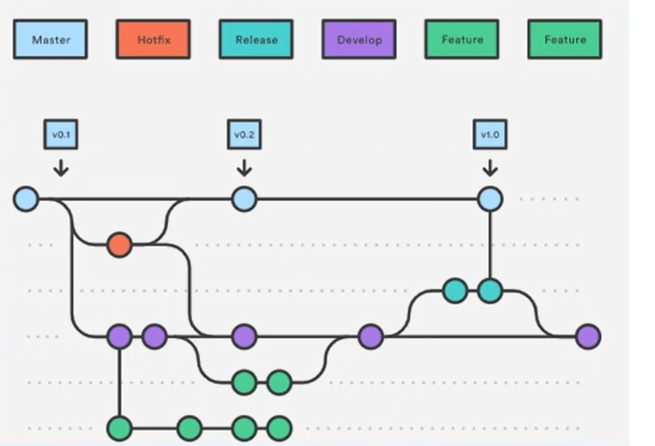

# Development and Operations

- **Equipe de desenvolvimento:** altera o codigo e implementa novas funcionalidades
- **Equipe de operações:** se preocupe com a estabilidade e desempenho do sistema em produção

 A ideia é que engenheiros trabalham em todo o ciclo de vida da aplicativo, da fase de desenvolvimento e testes até a implantação e as operações. Em geral, eles não são limitados a uma única função, são full cycle (não full stack)

### Práticas comuns

 - Infraestrutura como código (IaC)
 - Pipeline de construção do software (integração e entrega contínua)
 - Virtualização e conteinerização
 - Feedback constante da aplicação em produção através de monitoramento

## DevSecOps

- Segurança em primeiro lugar
- Velocidade
- Entrega rápida de contínua (CI/CD)
- Confiabilidade

Uso de GitLab, Jenkins, CodePipeline, BitBucket

## Observabilidade

- Métricas

Prometheus - Banco de dados de métricas  
Grafana - Visualização

- Traços distribuídos

Jagger - Possibilita instrumentação ao nível de aplicação ou a nível de infra. Possibilita colocar Service Mesh (Istio), Proxies (Envoy, Traefik, Kong)

- Logs

Opções: Sidecar, Logging agent instalado no host, Shell script  

Ferramentas: Graylog

Ver depois: Netdata com Slack

## Impacto sob a perspectiva do cliente (4 Golden Signals)

Coisas que são importantes considerando o cliente com exemplos

- Latência
  - Rapidez de conseguir um táxi
- Erros
  - Transferência bancária
- Tráfego
  - Divulgação de promoção
  - Votação do BBB
- Saturação
  - Transferências por minuto
  - Downloads por minuto

## Containers vs VMs

## Serverless

Facilitamento do processo de deploy na nuvem. É um paradigma de executar código sem se preocupar com servidores. Ao contrário do que o nome sugere, os servidores ainda existem

- Amazon Web services
- Microsoft Azure
- Google Cloud

### Prós

- Paga somente pelo que usa
- Cada função pode ser criada em uma linguagem diferente
- Muitos eventos pré-configurados na Cloud ajudam a criar arquiteturas orientadas a eventos
- Auto escalável, altamente disponível por natureza

### Contras

- Duração de execução limitada
- Vendor Lock-In
- Difícil de debugar
- Configuração extra para controlar (parcialmente) o ambiente de execução (lambda layers)

### Componentes

Além desses tem o SQS, SNS relacionados a Mensageria e Tópicos

### Custo

## IoC - Infraestrutura como código

Dockerfile, dockercompose.yml, heroku.yml, setup-vagrant.sh.....

- Facilidade de implantação na nuvem

## Integração Contínua

- Controle de versão
  - Organização
  - Modelos de ramificação
- Builds e testes automatizados
- Build pipeline
- Continuous delivery/deploy

Resolve o problema do merge hell

### Branching Models

- Everyone commits to the mainline every day
- Commits simples e lançáveis, orientado às tarefas
- Branches atrasam integração
- Branches de vida curta = Merge simples
- Muitos branches = Mais burocracia
- Estratégias devem ser combinadas pela equipe

#### Estratégias

- One flow

  - Pull Request Flow

- Trunk based development - Reduza distância entre os branches ao mínimo

- Feature Branch Flow - 1 branch por feature
- GitHub Flow - Master + Feature Branch + Pull request

- GitLab Flow - Master + Feature Branch + Pull request + ENV Branches
- Git Flow - Feature branches + Pull request + Maintenance Branches + Historical branches

#### Tipos de branches

- Local branches (temporários)
- Feature branches  
- Historical branches (master e development)
- Environment branches (staging e production)
- Maintenance branches (release e hotfix)

#### Branch By Abstraction

"Branch by Abstraction" é uma técnica para fazer uma mudança em grande escala em um sistema de software de forma gradual que permite liberar o sistema regularmente enquanto a mudança ainda está em andamento.

Criamos uma camada de abstração que captura a interação entre uma seção do código do cliente e o fornecedor atual. Alteramos essa seção do código do cliente para chamar o fornecedor inteiramente por meio dessa camada de abstração.

Gradualmente, movemos todo o código do cliente para usar a camada de abstração até que toda a interação com o fornecedor seja feita pela camada de abstração. Ao fazermos isso, aproveitamos para melhorar a cobertura de testes unitários do fornecedor por meio dessa camada de abstração.

Construímos um novo fornecedor que implementa os recursos requeridos por uma parte do código do cliente usando a mesma camada de abstração. Quando estivermos prontos, mudamos essa seção do código do cliente para usar o novo fornecedor.

Nós gradualmente trocamos o fornecedor defeituoso até que todo o código do cliente use o novo fornecedor. Uma vez que o fornecedor falho não é necessário, podemos excluí-lo. Também podemos optar por excluir a camada de abstração quando não precisar mais dela para migração.

### Merge x Rebase

https://www.atlassian.com/br/git/tutorials/using-branches/git-merge
https://www.atlassian.com/br/git/tutorials/using-branches/merge-conflicts
https://www.atlassian.com/br/git/tutorials/using-branches/merge-strategy
https://www.atlassian.com/br/git/tutorials/rewriting-history/git-rebase

### Build automatizado

- Uso de ferramentas pra automatização
- Commit-Build
- Build deve ser independente da IDE
- Tudo que precisa estar no repositório
  - Install scripts, Env files, Build scripts,Config files, Database files, Code
- Estrutura de arquivos bem definida
- Builds rápidos que falham rápido (10 minutos)
- Script único que construí para ambientes (parametrizado)
  - Comando único de build
- Build Machine (CI daemon)
- Se for impossível executar todos os testes (por causa da infraestrutura ou demora da execução), é possível executar apenas os testes de unidade ou uma suíte de testes mais importantes (smoke testes)

### CI Certification

1) Você comitta diariamente o seu código no pipeline do projeto?
2) Build e testes automatizados trazem confiança que está correto?
3) Quando um build quebra a equipe conserta em +- 10 minutos?

## Entrega Contínua

- A integração contínua é uma prática que faz parte da entrega contínua
- Define uma série de práticas e padrões para construir e deployar a aplicação continuamente. Padrões:
  - Deployment pipeline
  - Deploys de baixo risco
    _ Deploy incremental
    - Separar deploy e publicação
    - Deploy frequente
    - Otimizar para resiliência

- Qualquer alteração no trunk principal é releasable (pode entrar em produção)
- A entrega contínua é uma evolução da integração contínua e envolve todo o ciclo do projeto, incluindo equipes de QA, deploy e operações
- A diferença entre a entrega contínua e o deploy contínuo é, que no deploy contínuo todas as alterações realmente entra em produção, o tempo todo Não deve existir nenhum motivo técnico para impedir o deploy (apenas um motivo de negócio).

### Anti-patterns

- Gerenciamento manual de ambientes -> Pode causar erro de funcionamento em X ambiente mas nao em Y, por ex.: Homologação vs Produção

- Deploy manual -> Resulta em deploy lento, não confiável
  - "Segue as insruções de deploy?"
  - Dev nunca viu Ops? Só "um" faz o deploy
  - Ligações frequentes entre Dev e Ops antes do deploy?
  - Deploys longos (horas ou dias)?
  - Rollbacks frequentes

- Deploy apenas no fim do ciclo -> Pouca colaboração, problemas no dia de publicação, não confiável, lento, achismo

### Elementos

- Cultura DevOps
  - Feedback, colaboração, confiança
  - Melhoria e aprendizagem contínua
- Patterns
  - Deployment pipeline
  - Deploy patterns (blue/green, canary, feature toggle...)
- Arquitetura
  - Novas propriedades: testability, deployability
  - SOLID, Services, 12 Factor App

### Boas práticas

- Pipeline é a única forma de deploy
- Mantém o pipeline o mais rápido posível
- Build apenas uma vez
- Build independente do ambiente
- Ambiente igual/semelhante ao de produção
- Ambientes efêmeros (temporários)
- Deploy para ambientes de maneira igual

- Testes de Aceitacao
  - Equipe define junto as especificações (qa, analista, dev)
  - Responsabilidade do time todo
  - Smoke test do ambiente
  - Mockagem de sistemas externos
  - Precisa de bons requisitos
  - Design pattern nos testes
  - Desempenho não é o mais importante

- Homologação
  - Testes manuais pelo cliente
    - Consegue usar como esperado?
    - Faz o que pediu?
    - Teve dificuldades?
  - Validação do software
  - Usa desde o início
  - Equipe deve participar (feedback!)

- Tese de capacidade
  - Estabelecer metas claras e saber o baseline
  - Usar ferramentas de monitoração
  - JMeter, Gatling, Webload, Apache Bench, LoadNinja
  - Não precisam rodar a cada build mas idealmente seguem um ciclo constante

- Releases de baixo risco
    - 12 factor https://12factor.net/
    - Desacoplamento do Deploy
    - Release pattern
      - Blue/Green

      - Canary

      - Feature toggle -> Seleção de usuários a nível de código
