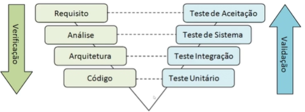

# Quality Assurance

## O que faz um QA

- Testes
- Debug e logs
- Pequenas implementações com pair programming

### Manifesto de Teste Ágil

- Testar durante o desenvolvimento
- Prevenir bugs
- Testar o entendimento, não só funcionalidades
- Construir um sistema melhor
- Time todo é responsável pela qualidade

## Testes

<table>
  <tr>
    <td>Casos de teste</td>
    <td>Nome exclusivo pra identificar esse caso de teste</td>
  </tr>
  <tr>
    <td>Pré-condições</td>
    <td>Estado do sistema para executar o caso de teste</td>
  </tr>
  <tr>
    <td>Procedimentos</td>
    <td>Os passos necessários para executar o caso de teste</td>
  </tr>
  <tr>
    <td>Resultado esperado</td>
    <td>O que se espera</td>
  </tr>
  <tr>
    <td>Mínimo de aceite</td>
    <td>Critérios mínimos que o resultado precisa ter</td>
  </tr>
  <tr>
    <td>Dados de entrada</td>
    <td>Exemplo: inputs de formulários</td>
  </tr>
  <tr>
    <td>Critérios especiais</td>
    <td>Se há critérios especiais</td>
  </tr>
  <tr>
    <td>Ambiente</td>
    <td>Onde deve ser executado o caso de teste</td>
  </tr>
  <tr>
    <td>Ambiente</td>
    <td>Onde deve ser executado o caso de teste</td>
  </tr>
  <tr>
    <td>Implementação</td>
    <td>Manual ou automatizada</td>
  </tr>
  <tr>
    <td>Iteração</td>
    <td>Quantas vezes</td>
  </tr>
</table>

### Padrão BDD

**Dado** - Quais pré-condições devem ser verdadeiras para que eu execute o teste?

**Quando - E** - Qual ação será executada no sistema que fornecerá o resultado válido?

**Então** - De acordo com a ação disparada qual o resultado esperado?

Ex.: Dado que eu tenho uma conta na netflix, QUANDO eu for assistir um filme E não tiver logado, serei redirecionado para a página de login E digitarei meus dados corretos ENTÃO serei redirecionado para o catálogo.

### Tipos de teste

- Testes funcionais
  - **Teste de regressão** -> técnica de teste a ser aplicada quando surgem novas versões mais recentes do software e garante que não surjam novos defeitos em componentes já analisados
    - **Teste de sanidade** é o subconjunto do teste de regressão e também é realizado quando não temos tempo suficiente para fazer o teste mais elaborado. Ele tem um nível superficial e verifica se as funcionalidades mais críticas do sistema estão conforme o esperado
  - **Teste de limite** -> Consistem em testar os valores mínimo e máximo (ou primeiro e último valores) de uma partição. Essa técnica é geralmente usada para testar requisitos que exigem um intervalo de números (incluindo datas e horas. Ex.: Limite de caracteres em uma senha
  - **Teste de estado** -> Ex.: Semáforo, useState (React)
  - **Teste exploratório** -> Para conhecer as possibilidades. Ex.: navegação em um site

- Testes não funcionais
  - Performance -> Ex.: Capacidade, carga, stress
  - Cache -> Ex.: CSS, JS
  - Usabilidade
  - Acessibilidade
  - Segurança -> Ex.: Prevenção à hackers

Ex.: Google Lighthouse

### Possibilidades

- Teste de caixa branca
  - QA Técnicos que entendem a arquitetura
  - Testes unitários
  - Teste de integração de Componentes
  - Teste de serviços (API)

- Teste de caixa preta
  - Teste de aceitação
  - Teste de sistemas
  - Teste de usabilidade

- Evidência de testes -> são imagens e/ou vídeos que comprovam que um determinado teste foi executado e o resultado esperado foi obtido. Podem ser screenshots de uma determinada tela ou o vídeo de um software em funcionamento. São importantes para documentar os testes realizados, servindo de insumos e métricas. Uso de gravador de passos.

## Definição de pronto

[ ] Precisam de testes pré-lançamento?

[ ] Podem apresentar bugs?

[ ] Precisam passar por outra validação além de QA?

- Tem que valer para todas as funcionalidades
- Define se uma atividade foi concluída ou não

## Bugs

<table>
  <tr>
    <td>Título</td>
    <td>Passos para a reprodução</td>
    <td>Resultado esperado</td>
    <td>Versão</td>
    <td>Plataforma</td>
    <td>Navegador</td>
    <td>Criticidade</td>
    <td>Status</td>
    <td>Evidência</td>
  </tr>
  <tr>
    <td></td>
    <td></td>
    <td></td>
    <td></td>
    <td></td>
    <td></td>
    <td></td>
    <td></td>
    <td></td>
  </tr>
</table>

###### Boas práticas

- Report de bug preciso e detalhado
- Reportar imediatamente
- Reproduza o bug pelo menos três vezes
- Teste em outras plataformas e modelos
- Não use linguagem abusiva

### Classificação e criticidade

- Crítica / Blocker
- Grave
- Moderada
- Pequena

## Ferramentas

Deve ser definino as ferramentas que serão utilizadas, suas finalidades e qual time irá usar qual (Times de qualidade, desenvolvimento e de QA). Ex.: POSTMAN - Qualidade, Jasmine - Desenvolvimento e Selenium - QA

## Escopo de testes

Deve ser definido os escopos de teste no projeto, isto é, a divisão. Ex.: 60% testes unitarios, 1 teste e2e no Login, testes de integração em todos endpoints

- Abrangência dos testes
  - O que será testado
  - O que não será testado
- Tipos de testes
- Estratégia de lançamento no sistema
- Times responsáveis pelos testes

## Esforço do teste 

- Tamanho do produto
- Complexidade do software
- Detalhes para documentação
- Ferramentas usadas
- Habilidades de pessoas envolvidas
- Se é necessário retrebalho

### Métricas de qualidade

- Total de defeitos
- Total de defeitos em Produção
- Total de defeitos removidos
- Tempo médio de reparo
- Quantidade de testes automatizados
- Cobertura de código
- Satisfação do usuário

# Recomendação de softwares

- TestLink
- Jira
- Mantis
- Bugzilla
