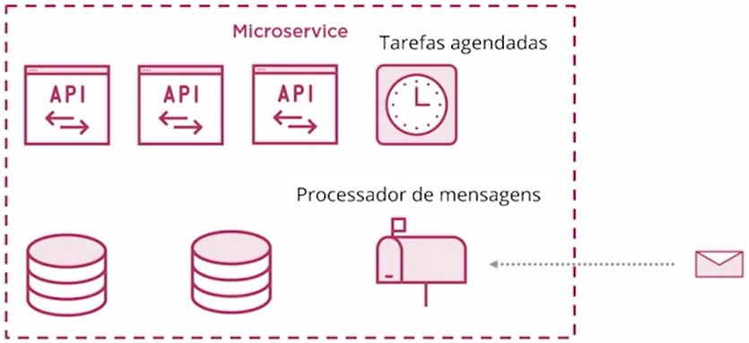
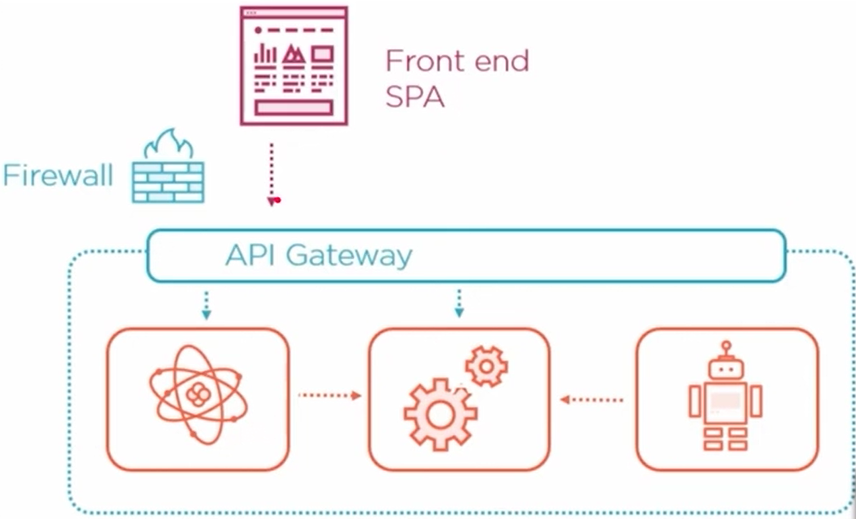

# Engenharia de Software

#### Design vs Arquitetura de Software

- Arquitetura de Software: visão de mais alto nível, separação de camadas, pastas da aplicação

- Design: mais baixo nível, padrões como SOLID

## Arquitetura Hexagonal

## Arquitetura Clean

### Domain Driven Design

#### Padrões táticos

#### Padrões estratégicos

- Divisão de contextos/funcionalidades - prevenir que uma aplicação quebre por completo, apenas pequenas partes quebrariam
- Domínio e subdomínio
- Linguagem ubíqua

## Arquitetura movida a eventos

- Event Bus: Mensageria
- Exemplo de aplicação que abusa de event sourcing: Git

### Escalabilidade

- Horizontal: Instâncias (servidores)
- Vertical: Hardware
- Em profundidade

### Modelagem de eventos

1. Brainstorming

- Simplificação

2. Ordenação lógica

3. Storyboard

4. Identificando entradas

5. Identificando saídas

6. Lei de conway

7. Elaboração de cenários

#### Vantagens

## Arquitetura de microsserviços

### API

#### Padrões de API

- SOAP
- REST
- RPC

#### API Gateway

- Cache
- SSL
- Logging

##### Comportamentos

- Autorização e redirecionamento
- Uso de decorator pra adicionar informações necessárias nos requests
- Limitar o acesso ou conteúdo trafegado

#### Service Mesh

Camada dedicada de infraestrutura para observação, testes, gerenciamento de tráfego e segurança de serviços. Ela é adicionada, existem ferramentas para isso

### Tipos de microsserviços

- **Data service:** conexão com banco de dados
- **Business service:** regras de negócio, ex: validação de dados
- **Translation service:** conector com API externa, feito para facilitar manutenção
- **Edge service:** define comportamento, ex.: envia dados diferentes de uma API para Mobile ou Web

### CQRS - Command Query Responsibility Seggregation

Para microsserviços com muito tráfego

- Leitura e escrita separados
- O modelo de leitura pode ter informações agregadas de outros domínios
- O modelo de escrita pode ter dados sendo automaticamente gerados
- Aumenta MUITO a complexibilidade do sistema

### Falhas em comunicação síncrona

- Uso de Circuit Breaker & Cache no Gateway

### Asynchronous Events

- Determinados problemas não podem ser resolvidos imediatamente
- Um serviço emite um evento que será tratado em seu devido tempo
- Serviços de mensageria/stream de dados brilham

### Falhas em comunicação assíncrona

- Retry
- Retry com back-off
- Fila de mensagens mortas
- Mensagens devem poder ser lidas fora de ordem
- Mensagens devem poder ser repetidas rapidamente (idempotência)

### Componentes

São servidores ou aplicacoes de infra

### Independência

- Apenas faça modificações aditivas
  - Novos endpoints
  - Novos campos opcionais em cada recurso
- Versionamento de APIs
  - Ao lançar uma v2, a v1 deve continuar funcionando inalterada
- Manter equipes separadas, donas de cada serviços
  - A mesma equipe não vai alterar os clientes
  - Para adicionar funcionalidades que dependem de outros, solicitações formais podem ser feitas

### Definição de um padrão

- Criação de Logs
- Health checks
- Métricas
- Busca por configs e secrets  

### Técnicas de autenticação

- Basic http
- Tokens jwt
- OAuth
- OpenID connect

### Técnicas de autorização

- ACL (Acess Control List)
- RBAC (Role-based access control)
- On behalf of

### Firewall

### Como me proteger mais?

- Atacantes (hackers) utilizam ferramentas modernas. Conheça essas ferramentas! Estude os possíveis ataques
- Ter uma equipe de infosec e executar pentests
- Automatize verificações de segurança. Fazer requisições com certificados, usuários não autorizados, etc
- Monitorar e detectar ataques em tempo real
- Ter logs e auditar os sistemas com freq.

### Ambientes

- Dev
- Staging / QA
- Homologação
- Prod

#### Configurações parametrizadas

- Configuração do ambiente em si
  - Quantidade de recursos
  - Localização
- Configurações da aplicação
  - Destino de logs
  - Dependências
  - Dados de acesso

### Estratégias de releases

- Rolling upgrade: atualizar os servidores aos poucos
- Blue-green: redirecionamento pra novos servidores, se der ruim tira o redirecionamento
- Feature-toggle: ativar a nova release apenas para poucas pessoas

### Comparação: Arquitetura Monolítica x Clean x de microsserviços

#### Desvantagens

- Maior complexidade de desenvolvimento e infra
- Debug mais complexo
- Comunicação entre os serviços deve ser bem pensada
- Monitoramento é crucial
- Diversas tecnologias pode ser um problema

Leitura: https://martinfowler.com/bliki/MonolithFirst.html
